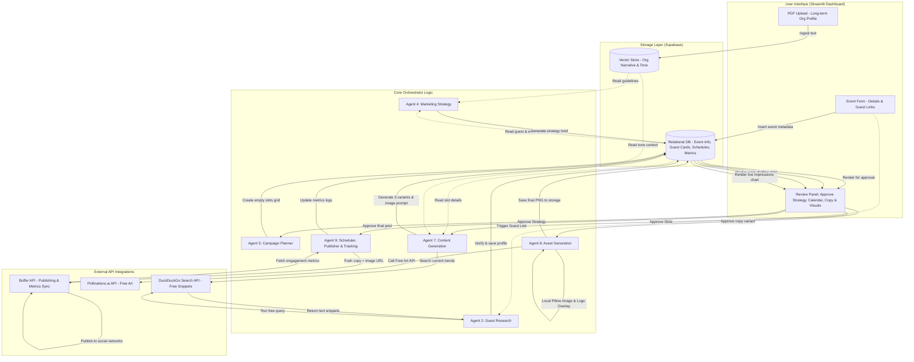

# AI Marketing Automation System — Final Documentation

**Version:** 1.0  
**Started:** July 4, 2026  
**Status:** In Progress — Finalizing Agent by Agent  

---

## Table of Contents

1. [High-Level System Architecture](#high-level-system-architecture)
2. [Agent 1: Organization Knowledge Base](#agent-1-organization-knowledge-base)
3. [Agent 2: Guest Research Agent](#agent-2-guest-research-agent)
4. [Agent 4: Marketing Strategy Agent](#agent-4-marketing-strategy-agent)
5. [Agent 5: Campaign Planner Agent](#agent-5-campaign-planner-agent)
6. [Agent 7: Content Generation Agent](#agent-7-content-generation-agent)
7. [Agent 8: Asset Generation Agent](#agent-8-asset-generation-agent)
8. [Agent 9: Scheduler, Publisher & Tracking Agent](#agent-9-scheduler-publisher-tracking-agent)

---

## High-Level System Architecture

This diagram shows how data flows through the user interface, the hybrid storage databases, the core agents, and free external API integrations to publish and track post metrics.



---

## Agent 1: Organization Knowledge Base

**Status:** ✅ Finalized  
**Date Finalized:** July 4, 2026

---

### Purpose
Store all organization and event-related data as a centralized knowledge foundation so that every other agent can access it whenever needed — without asking the user repeatedly.

---

### Storage Approach: Hybrid (RAG + Relational DB)

#### Long-Term Data → RAG (Vector Store)
*Stable data — rarely changes, reused across all events*

| Data | Example |
|------|---------|
| Organization mission | "Empowering youth through tech education..." |
| Vision | "To become Pakistan's largest tech community..." |
| Origin story | "Founded in 2020 during COVID when..." |
| Brand tone & voice | "Friendly, professional, inspiring — never salesy" |
| Founder/team bios | "Ali started this journey when he was..." |
| Services offered | Workshops, events, mentorship programs |
| Past event highlights | "In our 2025 summit, 500+ people attended..." |
| Testimonials | "This event changed my career — Attendee" |
| Community description | "10,000+ members across LinkedIn and WhatsApp..." |
| Brand guidelines | Color palette, font preferences, do's and don'ts |

#### Short-Term Data → Relational DB
*Changes per event — needs exact values, not approximate*

| Data | Example |
|------|---------|
| Event name | "AI Summit 2026" |
| Event date & time | July 25, 2026 — 10:00 AM |
| Venue | Pearl Continental, Lahore |
| Registration link | forms.google.com/xyz |
| Ticket price | Free / Rs. 500 |
| Current sponsors | Company A (Gold), Company B (Silver) |
| Agenda | Session 1: 10AM, Session 2: 11AM... |
| Current guest list | Guest IDs linked to this event |
| Target Platforms | Selected checkboxes: `['LinkedIn', 'Twitter', 'Instagram', 'YouTube']` |
| Run Paid Ads | Toggle: `True / False` (Saves tokens/costs if False) |
| Campaign status | Active / Completed |
| Post schedule status | Scheduled / Published / Failed |

---

### Data Ingestion Method: Hybrid (PDF Upload + Simple Form)

#### Organization Data → PDF Upload (One-Time / Updatable)
* User uploads a brand/company profile PDF.
* System extracts and chunks the text.
* Chunks are stored in the Vector Database (RAG) for semantic search.
* Updatable: If organization details change, user simply uploads the new PDF to overwrite the old vector index.

#### Event Data → Simple Form (Per Event)
* User fills a structured web form containing event details.
* Form includes guest links (URLs) to trigger downstream guest research.
* Exact values are saved directly into the Relational Database.
* Form fields will be finalized at the end of the design process based on all agents' needs.

---

### Agent Access Pattern

| When Agent Needs... | It Queries... | Type of Retrieval |
|---------------------|--------------|-------------------|
| Brand tone for writing content | Vector Store (RAG) | Semantic Search Query |
| Organization story for a post | Vector Store (RAG) | Semantic Search Query |
| Event registration link | Relational DB | Direct Database Query (Exact Match) |
| Event date and venue | Relational DB | Direct Database Query (Exact Match) |
| Past event testimonials | Vector Store (RAG) | Semantic Search Query |

---

### Success Criteria ✅
- All organization narrative data accessible via semantic query.
- All event metadata accessible via direct lookup query.
- Brand tone and core mission are accurately represented in content.
- Event details (dates, links, location) in campaigns are always 100% accurate.
- Input process is efficient: one-time PDF upload + brief event form per campaign.

### Failure Indicators ❌
- System generates wrong dates or invalid links in social media content.
- Brand tone deviates because the vector index fails to retrieve context.
- System requires user interaction to resolve basic event parameters after the form is submitted.

---

*Agent 1 finalized. Moving to Agent 2: Guest Research Agent.*

---

## Agent 2: Guest Research Agent

**Status:** ✅ Finalized  
**Date Finalized:** July 4, 2026

---

### Purpose
Autonomously research and construct a detailed, reputation-based professional profile for each event guest/speaker to power high-impact marketing content without relying on manual user input.

---

### Data Gathering Strategy: Iterative Snippet Search
To avoid complex web scraping setups (like headless browsers) and bypass platform login walls (like LinkedIn and Instagram's restrictions), this agent uses an **API-driven Search Engine Snippet Retrieval** strategy.

```
Guest Name & Social Links (From Event Form)
                     ↓
       Phase 1: Discovery Query (Search API)
                     ↓
      AI analyzes initial snippets to identify 
         guest's niche/domain of reputation
                     ↓
       Phase 2: Dynamic Query Expansion
     (Targeted searches for quotes, projects, impact)
                     ↓
          Consolidated Text Block
                     ↓
    AI Synthesis, Fact Verification & Filtering
                     ↓
      Structured Guest Profile Card (DB & RAG)
```

#### Detailed Flow:
1. **Input:** The agent receives the Guest's Name and/or social media URLs submitted in the Agent 1 Event Form.
2. **Discovery Search:** The system runs a search engine API query (e.g., `site:linkedin.com/in/ "Guest Name"`) to retrieve search result titles and summary snippets.
3. **Reputation Assessment:** An AI model reads these initial snippets to discover what the guest is actually known for (e.g., teaching AI, building Web3 startups, corporate training) rather than just retrieving static background data.
4. **Deep-Dive Search:** Based on the niche discovered, the system dynamically generates expanded queries (e.g., `"Guest Name" "Governor Initiative" students` or `"Guest Name" "Tech Award"`).
5. **Timeline Filtering & Extraction:** The system compiles the snippets, analyzes the chronological details to accurately isolate the **Current Designation**, and extracts achievements, quotes, and media links.
6. **No-Login Access:** By reading the search engine's indexed cache (snippets) instead of clicking the links, the system never interacts with LinkedIn/Instagram servers, avoiding rate-limiting or login walls.

---

### Data Collected

| Category | Specific Elements |
|----------|-------------------|
| **Basic Information** | Name, Current Designation (isolated chronologically), Company, Industry, Biography/Background, Career Journey, Education. |
| **Achievements & Skills** | Awards, Books, Projects, Startups founded, Patents, Key Areas of Expertise. |
| **Public Content & Talks** | LinkedIn, X/Twitter, Instagram, YouTube Talks (videos/metadata), Podcasts, Blogs/Articles. |
| **Marketing Assets** | Famous Quotes (e.g., "AI won't replace humans..."), Interesting/viral moments from interviews, URLs to professional headshots, stage photos, and company logos. |

---

### Verification & Fallback Logic
* **Multi-Source Check:** To prevent AI hallucinations, key achievements or quotes must appear across multiple search result snippets before being marked as verified.
* **Fallback Search:** If social media links are unavailable or blocked, the agent automatically pivots to search personal websites, blog platforms, or press releases.

---

### Success Criteria ✅
- Detailed profile card generated within 2-3 minutes of form submission.
- Current designation is 100% accurate and up-to-date.
- AI extracts reputation-based achievements (e.g., "trained 100k students") instead of generic details.
- Zero manual input required from the user to construct the biography.

### Failure Indicators ❌
- System extracts outdated job roles as the current designation.
- Guest profile contains hallucinated facts or unverified quotes.
- Process fails silently when a social media profile is private (system should raise an alert and fallback to public search instead).

---

*Agent 2 finalized. Moving to Agent 4: Marketing Strategy Agent.*

---

## Agent 4: Marketing Strategy Agent

**Status:** ✅ Finalized  
**Date Finalized:** July 4, 2026

---

### Purpose
Act as the system's Chief Marketing Officer (CMO). This agent takes factual organization, guest, and audience data and applies proven marketing frameworks to construct a cohesive Campaign Strategy Brief.

---

### Core Logic & Copywriting Frameworks

💡 **USER DEEP-DIVE REMINDER:**  
When you focus on this agent, explore and select the best copywriting/marketing frameworks to guide the AI's logic. The agent's prompt will dynamically enforce the chosen frameworks to structure the copy angles.

*Framework Options to Shortlist & Test Later:*
*   **Option A (PAS):** *Problem, Agitate, Solve* (Best for highlighting audience pain points and positioning the event as the solution).
*   **Option B (AIDA):** *Attention, Interest, Desire, Action* (Standard structural hook model to map out the campaign progression).
*   **Option C (StoryBrand):** *Make the audience the hero, and the guest/guide the solution* (Best for community building).
*   **Option D (Quest/Others):** *Qualify, Understand, Educate, Stimulate, Transition* (For high-ticket or technical events).

---

### Outputs Generated (The Strategy Brief)

| Section | Description |
|---------|-------------|
| **Core Positioning Hook** | The single high-impact message that defines the event's unique value (USP). |
| **Messaging Pillars** | Three distinct content angles structured using the selected copywriting frameworks. |
| **Objection Handles** | Specific counter-arguments for common registration barriers. |
| **CTA Hierarchy** | Phase-specific action rules (e.g., Phase 1: curiosity CTAs, Phase 3: direct urgency registration links). |

---

### Human-in-the-Loop Governance Gate
Before the system moves to Content Planning or Content Generation:
* The generated **Strategy Brief** is displayed on the Streamlit/Retool dashboard.
* The user must review, optionally edit, and click **Approve Strategy**.
* No automated content or planner runs until the strategy is explicitly approved (prevents token waste and off-brand generation).

---

### Success Criteria ✅
- Strategy Brief generated within 60 seconds of Guest/Audience research completion.
- Core positioning hooks directly match the brand voice profile.
- Explicit objection-handling strategy matches real audience pain points.
- Output is structured cleanly to feed directly into the Content Generation Agent.

### Failure Indicators ❌
- Strategy Brief contains generic marketing fluff (e.g., "come to have fun").
- Positioning contradicts the organization's long-term brand guidelines.
- Generation proceeds without human approval status being set to "Approved".

---

*Agent 4 finalized. Moving to Agent 5: Campaign Planner Agent.*

---

## Agent 5: Campaign Planner Agent

**Status:** ✅ Finalized  
**Date Finalized:** July 4, 2026

---

### Purpose
Plan, structure, and package the event marketing timeline. This agent serves as the master distribution coordinator, mapping copywriting assets into a chronological schedule and allocating them to the user's selected platforms.

---

### Workflow Strategy: Planning-First Allocation

To prevent platform-specific errors (like Twitter character limits or Instagram layout issues), the system plans the calendar slots **before** generating any copy:

```
                  Strategy Brief (Approved)
                              ↓
              1. Campaign Blueprint (Skeleton)
  (Define daily goals & themes based on timeline phases: 
   Awareness, Authority, Value, Urgency, Live, Retention)
                              ↓
             2. Platform & Format Allocation
  (Filter by selected target platforms & ads toggle.
   Create empty slots: e.g., July 10 | LinkedIn | Feed Post)
                              ↓
            3. Content & Asset Generation
  (Write text tailored specifically for each platform's character 
   limits and style, then generate matching image assets)
```

#### Detailed Steps:
1. **Blueprint Generation:** Based on the timeline phases (Awareness, Authority, Value, Urgency, Live, Retention), the agent maps out the day-by-day campaign themes.
2. **Platform & Ads Filtering:** The agent reads the user's selected **Target Platforms** and **Run Ads** preferences (from the Event Form). Any inactive platform is completely ignored, saving LLM tokens.
3. **Calendar Mapping:** Before writing copy, the system creates empty calendar slots (e.g., Date, Platform, Theme, and Format). This grid is passed directly to the Content Generation Agent so the copy is written natively for that platform's rules from the start.

---

### Governance & Verification Gate
* The planned campaign calendar grid (What to post, When, and Where) is rendered on the dashboard.
* User must review the empty plan before generation agent is triggered.

---

### Success Criteria ✅
- Complete campaign blueprint and platform slots mapped out before copy generation.
- Marketing campaigns are only created for the selected target platforms.
- Ads campaign configurations are bypassed entirely when the Ads toggle is set to `False`.
- The system guarantees zero character-overflow or formatting errors on publish.

### Failure Indicators ❌
- System generates copy without knowing the target platform beforehand.
- Urgency posts are scheduled too early in the campaign timeline.
- Ad copies are generated even when the user has disabled the Ads toggle.

---

*Agent 5 finalized. Moving to Agent 7: Content Generation Agent.*

---

## Agent 7: Content Generation Agent

**Status:** ✅ Finalized  
**Date Finalized:** July 4, 2026

---

### Purpose
Act as the system's professional copywriter. This agent takes planned campaign calendar slots, analyzes target platforms, adapts brand tones, and generates 3 distinct copy variations optimized to drive engagement and registrations.

---

### Key Capabilities

#### 1. Trend-Aware Content Matching
Before writing, the agent searches for current online discussions and buzzwords related to the event theme (e.g., `"[Event Theme] trends 2026"`). It naturally weaves these trends into the copy to increase algorithmic relevance and reach.

#### 2. Platform-Specific Tone Adaptability
While preserving the core event message, the agent dynamically adjusts the brand voice to match platform demographics:
*   **LinkedIn:** Professional, authority-building, whitespace-friendly.
*   **Instagram:** Casual, friendly, highly engaging, hashtag-rich.
*   **Twitter/X:** Bold, intellectual, punchy, thread-ready.
*   **Paid Ads (if enabled):** Benefit-focused, high-intent, direct action CTAs.

#### 3. Three-Variant Generation (A/B Variety)
For every post slot, the agent outputs exactly three diverse creative angles:
*   **Variant A (Story Hook):** Begins with a personal story or guest journey.
*   **Variant B (Direct Value Hook):** Lists concrete benefits, stats, or takeaways.
*   **Variant C (Question Hook):** Opens with a thought-provoking question to drive comments.

---

### Platform Copywriting Rules

| Platform | Style Rules | Character Limit | Formatting |
|----------|-------------|-----------------|------------|
| **LinkedIn** | Professional stories, insights, clear whitespace breaks. | ~3,000 characters | Double line-breaks for easy mobile reading. |
| **Instagram** | Engaging, visual-centric, community focus. | ~2,200 characters | Bullet lists, emojis, 5-10 relevant hashtags. |
| **Twitter/X** | Sharp, fast-paced, high impact. | Strictly < 280 characters | Thread layout if educational details are rich. |
| **Paid Ads** | High-intent hook, immediate benefit, direct link CTA. | Short/Medium | Direct registration focus. |

---

### Success Criteria ✅
- Generates 3 copy variants per slot in under 30 seconds.
- Copy matches platform-specific rules (never exceeds Twitter's 280-character limit).
- Tone is naturally adjusted according to platform (e.g., more casual on Instagram).
- Factually verified: Only uses quotes and stats validated in RAG and DB.

### Failure Indicators ❌
- Output copy is identical across all three variants (lack of creative diversity).
- Posts exceed platform character limits, causing publishing failures.
- Brand tone feels robotic or fails to match the platform's audience profile.

---

*Agent 7 finalized. Moving to Agent 8: Asset Generation Agent.*

---

## Agent 8: Asset Generation Agent

**Status:** ✅ Finalized  
**Date Finalized:** July 4, 2026

---

### Purpose
Generate and package visual assets (images, template banners, carousel outlines) to accompany content copies, maximizing engagement and scroll-stop factor on social feeds at zero operational cost.

---

### Visual Production Strategy: Three Flexible Input Modes
To give the user complete control over aesthetics while maintaining automation, the agent operates in three distinct logical modes:

| Mode | Input Provided by User | AI Processing & Action |
|------|------------------------|-------------------------|
| **Mode A (Fully Automated)** | None (System defaults) | AI scrapes guest headshots or calls the free **Pollinations.ai API** for conceptual/abstract art, overlays brand logos, and writes the event copy on top. |
| **Mode B (Guest Photo Override)** | Uploads a specific Guest Photo | AI bypasses web scraping, takes the user's provided guest photo, overlays it onto the standard event template, adds logos, and renders the text details. |
| **Mode C (Custom Base Banner)** | Uploads a custom designed background | AI skips background generation but **programmatically writes event titles, dates, and speaker names** on top of the user's uploaded banner, baking in the final copy. |

---

### Key Capabilities

#### 1. Zero-Cost Asset Engine
Uses local/open-source rendering libraries (`Pillow` / `html2image` in Python) to combine backgrounds, text, and logos into high-resolution PNGs at **$0 operational cost**.

#### 2. Automatic Logo & Content Overlay
All logos (organization logo, partner logos, sponsor tiers) and structured text details (date, venue, speaker name) are programmatically overlaid on exact coordinate points on the images. No manual pasting is required.

#### 3. Low-Cost Video Logic
To avoid expensive video rendering APIs, this agent **does not generate raw video files**. Instead, for Reels/Shorts campaigns, it outputs:
*   An engaging voiceover and dialogue script.
*   A step-by-step visual editing blueprint (e.g., *"Slide text 'Join Free' from left, sync transition with beat"*).

---

### Success Criteria ✅
- Banners and visual assets rendered in under 5 seconds.
- Logos and text details align perfectly on template coordinates.
- Supports background and image overrides from the user seamlessly.
- Visual styles match the brand colors and guidelines indexed in the RAG store.

### Failure Indicators ❌
- Overlaid text is unreadable or misaligned (overlapping with logos or guest faces).
- System crashes when a user uploads a custom base banner or guest photo.
- Outputs contain gibberish text on AI-generated conceptual backgrounds.

---

*Agent 8 finalized. Moving to Agent 9: Scheduler & Publisher Agent.*

---

## Agent 9: Scheduler, Publisher & Tracking Agent

**Status:** ✅ Finalized  
**Date Finalized:** July 4, 2026

---

### Purpose
Manage the publishing queue, automate posting to target social channels via official partner APIs (e.g., Buffer API) under a strict human approval mechanism, and track live post performance metrics directly on the user dashboard.

---

### The Interactive Review, Scheduling & Tracking Loop

No post is published automatically. Every draft (Copy + Visual Asset) must pass through the following interactive dashboard loop:

```
                  Post Draft Generated (Text + Image)
                                  ↓
                        Streamlit Dashboard Review
                                  ↓
                  [User Choice: What to do next?]
             /                    |                   \
     1. Approve               2. Fix / Feedback      3. Reject
        ↓                         ↓                      ↓
Calculate optimal time    User inputs comments      Post deleted/cancelled
Push to Buffer API queue  AI regenerates post       Status -> Rejected
Status -> Scheduled       Return to review loop
        ↓
    [Publish] (via Buffer)
        ↓
3. Performance Tracking (Periodic Sync)
  (Fetch Impressions, Link Clicks, Likes, and Comments from Buffer API
   and display them live in the Streamlit log)
```

#### Detailed Operations:
1. **Approve Mode:** If the user approves the draft, the agent automatically calculates the optimal posting time for that platform and pushes the payload (Text + Image URL) to the Buffer API. The status changes to `Scheduled`.
2. **Fix Mode (Feedback Loop):** If the user is unsatisfied, they input specific feedback. The generation pipeline runs again with this feedback to produce an updated draft, returning to the review screen.
3. **Reject Mode:** If the user rejects the post outright, it is marked as `Rejected` and cancelled.
4. **Performance Tracking Mode:** Once a post goes live (status: `Published`), the system runs a periodic background sync to pull live engagement metrics from Buffer.

---

### Live Performance Metrics Tracked

| Metric | Business Value | Display Location |
|--------|----------------|------------------|
| **Impressions (Reach)** | Measures how many screens the post appeared on. | Streamlit Dashboard (Post log row) |
| **Link Clicks (CTR)** | Measures how many users clicked the event registration link. | Streamlit Dashboard (Post log row) |
| **Interactions** | Aggregates Likes, Comments, and Shares. | Streamlit Dashboard (Post log row) |

---

### Success Criteria ✅
- Only user-approved posts are pushed to the live scheduling queue.
- Re-triggering the regeneration loop updates the draft with user feedback in under 15 seconds.
- Post metrics (Impressions, Clicks, Likes) update on the Streamlit dashboard every 24 hours.
- Zero accounts are flagged or banned because all publishing uses official, authorized API channels.

### Failure Indicators ❌
- Posts are published to live platforms without explicit user approval.
- The regeneration loop fails to apply the user's specific text corrections.
- Publishing queue or tracking API experiences silent failures (errors must update the status in the UI).

---

## 🏁 Blueprint Finalization
This document constitutes the complete conceptual design and requirements specification for the **AI Marketing Automation System**. All planned phases and agent architectures are finalized.

*Documentation Complete.*
