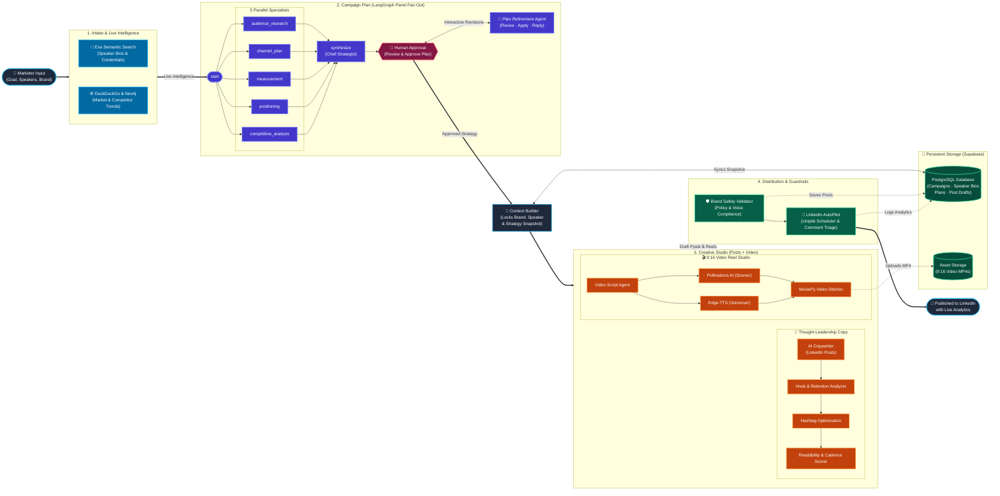

# AI Marketing Automation System — System Overview

---

## 1. Problem Statement

Event marketing today is bottlenecked by manual, fragmented workflows that degrade content quality and lower conversion rates:

*   **Information Silos:** Brand assets, guest details, and event logistics are scattered across emails, spreadsheets, and chat groups, leading to manual copy-paste errors and inconsistent brand tone.
*   **Time-Intense Guest Research:** Generating speaker profiles and marketing cards requires manual searching, scraping, and writing, which takes hours per guest.
*   **API Walls & Setup Overhead:** Standard web scrapers are frequently blocked by LinkedIn/Instagram login screens, requiring complex headless browser maintenance.
*   **Formatting & Platform Errors:** Writing raw copy before assigning it to a platform leads to character overflows (e.g., Twitter's 280-character limit) or visual formatting issues on publishing.
*   **Lack of Tracking:** Teams struggle to track impressions and clicks cleanly across multiple networks, preventing them from understanding what content actually drives registrations.

The business impact is **declining audience engagement, lower attendance rates, and significant time wasted on repetitive operations.**

---

## 2. Solution

The **AI Marketing Automation System** is an autonomous, multi-agent pipeline orchestrated to handle end-to-end event marketing with zero operational friction:

1.  **Unified Ingestion:** A one-time PDF upload stores long-term brand tone in a semantic search vector index, while a simple 2-minute form tracks structured event parameters (dates, links, platforms, guest URLs).
2.  **Autonomous Guest Research:** An iterative search engine agent bypasses login walls by scraping search snippets to build fact-verified, reputation-based speaker cards without human effort.
3.  **Human-Approved Strategy:** The system acts as a virtual CMO, generating a Strategy Brief (USP, messaging pillars, objection handling) that must be approved by the user before content planning begins.
4.  **Planning-First Scheduling:** Before writing copy, the system builds the calendar grid, ensuring that the Content Generator writes platform-native copy matching specific character limits (LinkedIn, Instagram, Twitter/X).
5.  **Branded Asset Generation:** Generates conceptual backgrounds via free image APIs and programmatically overlays speaker portraits, organization logos, and text elements at $0 cost.
6.  **Automatic Publishing & Metrics Tracking:** Pushes approved campaigns directly to social media queues and syncs engagement metrics (impressions, clicks, interactions) back to a unified Streamlit dashboard.

---

## 3. Architecture

This diagram illustrates the logical interaction between the User Interface, the Hybrid Storage layers, the Agent nodes, and free external API integrations.

---

## 4. Techstack

We prioritize open-source frameworks, local script processing, and free-developer-tier APIs to ensure a **$0 baseline operational cost** for the MVP.

| Layer | Selected Technology | Purpose / Advantage | Cost |
|---|---|---|---|
| **Agent Orchestration** | **LangGraph** (Python) | Graph-based state machine framework supporting cycles (loops) and human interrupts. | **$0** (Open-source) |
| **Relational Database** | **Supabase (PostgreSQL)** | Stores structured event details, schedules, and analytics tracking metrics. | **$0** (Free Tier covers up to 500MB) |
| **Vector Database (RAG)** | **Supabase pgvector** | Stores long-term brand narrative data and tone guides. | **$0** (Included with Supabase instance) |
| **Reasoning & Synthesis** | **Google Gemini 1.5 Flash API** | Drives the strategy brief generation, search snippet parsing, and copy writing. | **$0** (Generous Developer Free Tier) |
| **Search Engine API** | `duckduckgo-search` library | Performs iterative searches to build speaker profiles and retrieve trends. | **$0** (Unlimited, no keys required) |
| **Graphic Generation API** | **Pollinations.ai API** | Generates conceptual background art for templates. | **$0** (No API keys or payment required) |
| **Image manipulation** | **Pillow (PIL) & html2image** | Local Python engine to programmatically overlay speaker photos, brand logos, and titles on templates. | **$0** (Open-source) |
| **Scheduler & Analytics** | **Buffer API** | Standardizes publishing queue and pulls live impressions/clicks data. | **$0** (Free Tier covers 3 channels / 10 posts) |
| **Dashboard Interface** | **Streamlit** (Python) | A simple, fast Python web UI to display dashboards, review panels, and forms. | **$0** (Open-source) |
